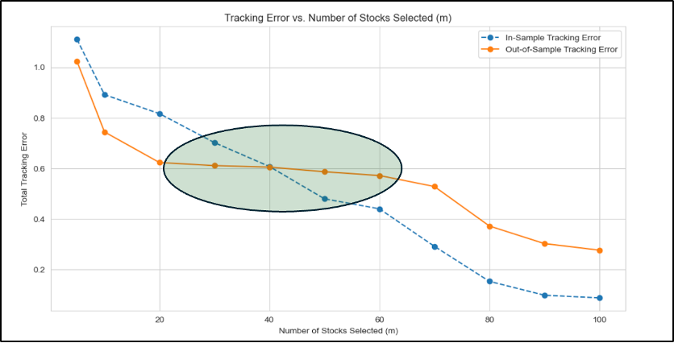
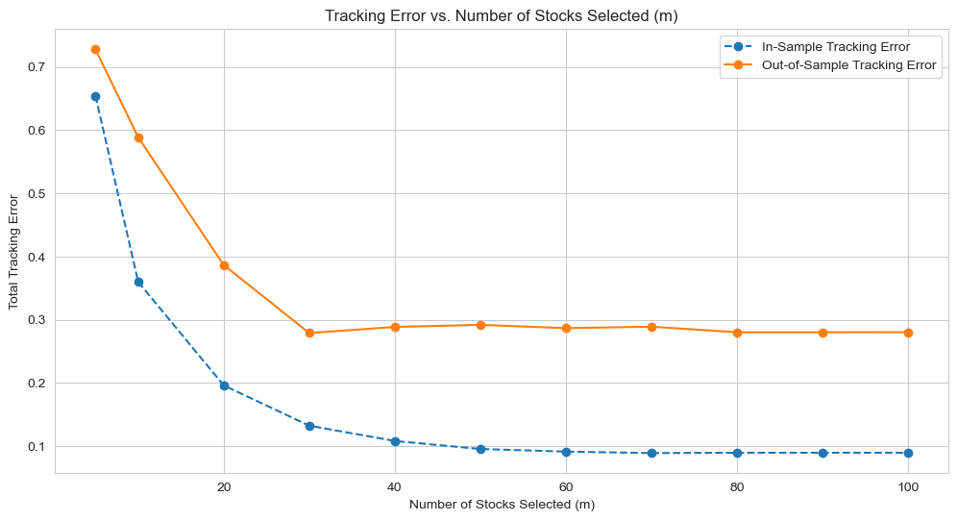
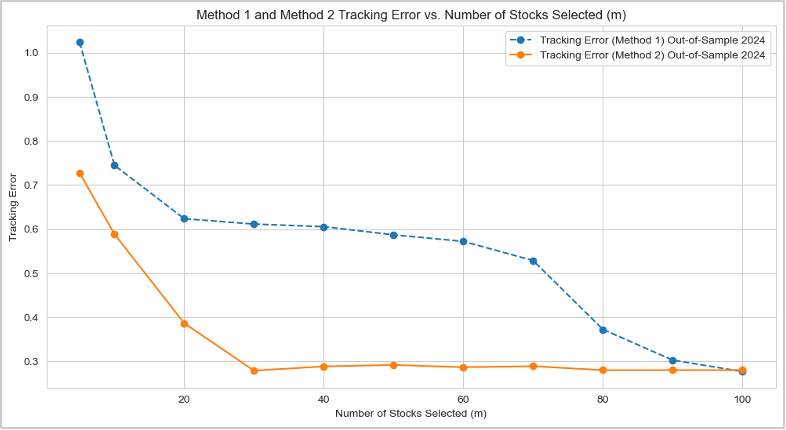
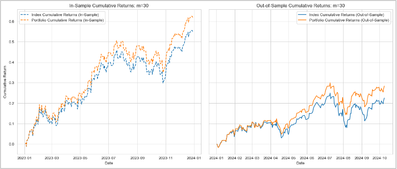
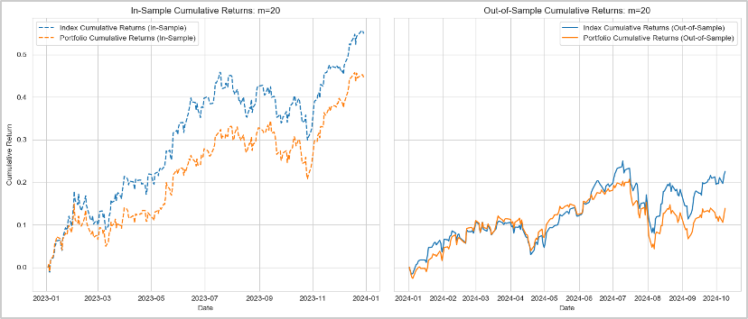

# Market Index Portfolio Optimization 

## Introduction

### Objective
This project aims to develop an optimized index-tracking fund utilizing integer programming methods to closely mirror the NASDAQ-100 index, ensuring high representational accuracy while minimizing portfolio rebalancing complexity.

### Problem Statement
Creating index-tracking funds typically involves high transaction costs and complex asset management strategies. We apply integer programming techniques to efficiently select a limited subset of stocks, leveraging correlation in stock returns, to effectively replicate NASDAQ-100 performance.

---

## Data Preparation

- **Data Loading:**
  - Loaded NASDAQ-100 daily stock prices from CSV files.

- **Handling Missing Data:**
  - Addressed missing values using linear interpolation, forward-fill, and back-fill methods.

- **Calculating Daily Returns:**
  - Computed daily percentage changes in stock prices.

- **Correlation Matrix Construction:**
  - Created a correlation matrix to measure similarity in stock returns.

---

## Linear Programming Approach

- **Stock Selection:**
  - Utilized Integer Programming (IP) to select a subset of stocks most similar to the NASDAQ-100.

- **Model Formulation:**
  - Maximized overall portfolio similarity based on stock return correlations.

- **Decision Variables and Constraints:**
  - Implemented binary variables for stock selection and representation.

- **Weight Selection:**
  - Optimized weights to minimize return deviations from the index.

- **Analysis of Subset Size (m):**
  - Assessed performance impacts of various portfolio sizes.

- **Performance Comparison (2023 vs. 2024):**
  - Compared in-sample (2023) versus out-of-sample (2024) tracking accuracy.

---

## Mixed-Integer Programming Approach (MIP)

- **Big M Technique:**
  - Employed the Big M approach to control the number of active stocks in the portfolio.

- **Constraints:**
  - Enforced total weight constraints, non-negativity, and specified portfolio size.

- **Objective Function:**
  - Minimized the cumulative tracking error relative to NASDAQ-100 returns.

- **MIP Findings:**
  - Demonstrated superior tracking precision with fewer selected stocks compared to IP.

---

## Recommendations

### Recommended Model
- **Mixed-Integer Programming (MIP)** is recommended due to its higher accuracy in tracking despite its computational complexity.

### Optimal Number of Stocks
- Recommend a portfolio of **30 stocks** using MIP for the ideal balance between accuracy and manageability.

### Observations
- **Linear Programming (LP):** Notably excludes large-cap stocks in smaller portfolios (m=5).
- **MIP:** Strategically includes large market-cap stocks, enhancing tracking performance.

---

### Summary
The MIP approach with a portfolio of 30 stocks offers an optimal solution, effectively tracking the NASDAQ-100 with significantly fewer holdings and complexity.

---

### Visualizations

---

### License
This project is licensed under the MIT License.

